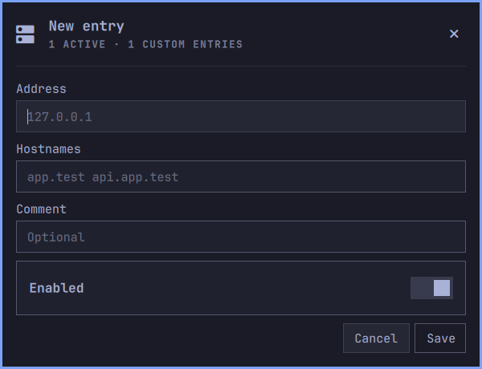

# omahosts

Manage local hosts entries from the Omarchy top bar. Search, add, edit, delete, and toggle mappings without opening a terminal.

omahosts follows your Omarchy theme and uses its native popup, controls, keyboard navigation, and authentication dialog. It edits `/etc/hosts`, including existing mappings and commented-out entries. Each row is one IP address and one or more hostnames; switching a row toggles all its hostnames together.



## Install

Requires Omarchy 4.0.4 or newer with the Quickshell shell, Python 3, and Polkit. These dependencies are included in the tested Omarchy installation.

```bash
omarchy plugin add https://github.com/gigerit/omahosts.git --enable
omarchy bar move gigerit.omahosts --after omarchy.network
```

Open the hosts icon next to Network. Each Save, toggle, or confirmed Delete requests administrator authentication. Cancelling authentication keeps the original file and any draft. Localhost mappings are read-only; other loopback mappings such as `127.0.0.1 app.test` are editable.

Hostnames are separated by spaces. Addresses can be IPv4 or IPv6. International hostnames must use punycode. Duplicate enabled names within the same address family are marked in the list; an IPv4 and IPv6 mapping for the same name is normal. Groups, wildcard domains, and DNS server configuration are not supported.

The operating system resolves hosts entries normally. Applications using their own DNS or caching may need a reload or restart.

## Keyboard

With the list focused:

| Key | Action |
| --- | --- |
| Up/Down or `j`/`k` | Select an entry |
| Left/Right or `h`/`l` | Select toggle, edit, or delete |
| Enter or Space | Perform the selected action |
| `/` | Search |
| `a` | Add an entry |
| `e` | Edit the selected entry |
| `x` | Confirm deletion of the selected entry |
| `r` | Refresh |
| Tab / Shift+Tab | Switch neighboring bar panels |
| Escape | Close the panel |

Inside forms, Tab moves between controls and Escape returns to the list. Search accepts normal typing; Down selects the list. Changes in a draft are saved only with Save.

```bash
omarchy-shell shell toggle gigerit.omahosts '{}'
omarchy plugin update gigerit.omahosts
omarchy plugin disable gigerit.omahosts
omarchy plugin remove gigerit.omahosts
```

Removing the plugin leaves hosts mappings and backups in place.

## File handling and recovery

The hosts file is the source of truth. There is no separate entry database. Untouched lines retain their bytes, order, comments, and whitespace. Toggling adds or removes a comment prefix; editing normalizes only the edited row. Valid commented mappings appear as disabled entries. Ordinary comments and unrecognized content are preserved without being exposed as editable rows.

The helper validates inputs, protects standard localhost names, locks against concurrent omahosts writers, checks for external changes before replacement, and atomically replaces the file while retaining ownership, permissions, and extended attributes. Files larger than 8 MiB and symlinked or hard-linked hosts files are refused. An external editor that does not honor the lock can still race the final rename; avoid simultaneous editing in two tools.

Before each write, a root-owned backup is created under `/var/lib/omahosts/backups/`. The latest 20 copies are retained. A failed backup prevents the write. Errors after a completed replacement are reported as warnings rather than claiming that nothing changed.

To recover, inspect the backups in a terminal and restore the chosen file:

```bash
sudo ls -lt /var/lib/omahosts/backups/
sudo cat /var/lib/omahosts/backups/hosts-CHOSEN-BACKUP
sudo cp /var/lib/omahosts/backups/hosts-CHOSEN-BACKUP /etc/hosts
```

Replace `hosts-CHOSEN-BACKUP` with the backup you inspected. The panel watches for external changes. If the file changes during editing, the draft is retained until you explicitly Reload or Cancel.

## Development

The repository root is the plugin root. Runtime consists of `manifest.json`, `Panel.qml`, and the self-contained `hosts.py` helper. Development happens in `~/Work/omahosts`; the installed plugin is a separate checkout. Make changes in the development repository and deploy tested commits to the installed checkout.

```bash
python3 -B -m unittest discover -s tests -v
omarchy plugin validate .
```

Tests use temporary files and never modify the machine's hosts file. They cover preservation, input validation, localhost protection, stale and concurrent writes, backup retention, permissions, and failure handling. When Bubblewrap and unprivileged user namespaces are available, an additional test runs the real privileged CLI as root inside a disposable namespace with isolated `/etc`, `/run`, and `/var` directories.

For initial local testing before publication:

```bash
git clone --no-hardlinks ~/Work/omahosts ~/.config/omarchy/plugins/gigerit.omahosts
omarchy-shell shell rescanPlugins
omarchy plugin enable gigerit.omahosts --after omarchy.network
```

After publication, set the installed checkout's origin to `https://github.com/gigerit/omahosts.git` so `omarchy plugin update` follows the published repository. The development checkout can use the SSH remote.

If QML changes remain cached after `omarchy-shell shell rescanPlugins`, use `omarchy restart shell` to load a fresh copy.

Use the installed `qs.Ui` controls and `qs.Commons` theme tokens. Verify visual changes in the running shell, including keyboard focus and authentication cancellation. Do not edit packaged Omarchy files. The privileged CLI accepts only `read`, `check`, and `apply`, with fixed system paths; tests pass temporary paths to the Python functions directly. Keep test-only path overrides out of the privileged CLI.
